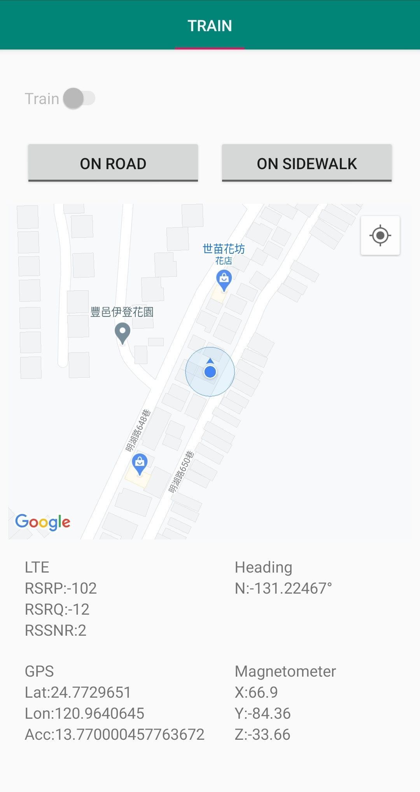

# MagRSS

This project aims to recollect fingerprint data from smartphone's built-in magnetometer, GPS, and cellular Received Signal Strength (RSS) in order to train a machine learning model.

By doing a mapping between...:

```
{ GPS coordinates (latitude, longitude) } ---> { Geomagnetic field strength (values for each of the three coordinate axes, namely (X, Y, Z) in μT) and Cellular signal strength (for each attached cell, in dBm )}
```

...And training a Neural Network with the above data *(and some crowdsourcing of course!)*, we can hopefuly localize users/smartphones using only the latter sensors (magnetometer and cellular) without having to rely on the resource-intensive GPS module.

## Example training data entries

latitude | longitude | magnetometer X | magnetometer Y | magnetometer Z | cellID001_dBm | cellID002_dBm | ... | hour of day (HH)
-------- | --------- | -------------- | -------------- | -------------- | ------------- | ------------- | --- | ---------
24.7893686 | 120.9950572 | 15.599999 | 15.54 | -43.02 | -85 | -80 | ... | 1700

## Android Application


