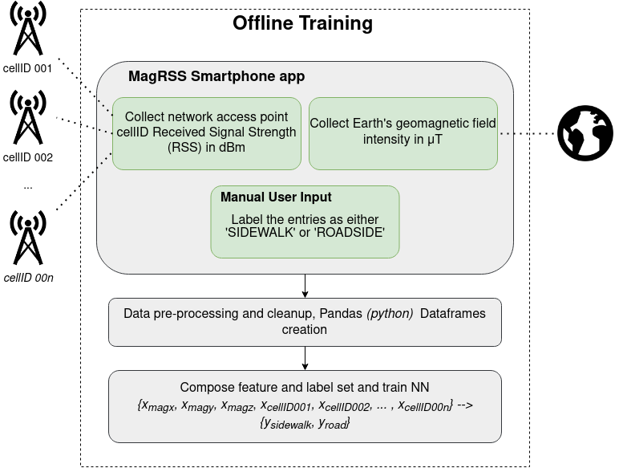
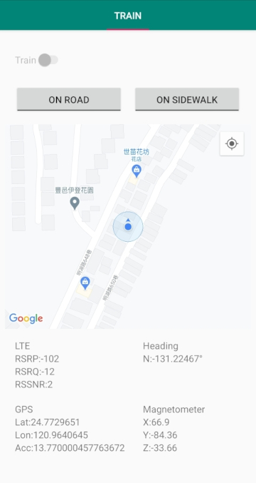

# MagRSS

This project aims to recollect fingerprint data from smartphone's built-in magnetometer, GPS, and cellular Received Signal Strength (RSS) in order to train a machine learning model.

By doing a mapping between...:

```
{ GPS coordinates } ---> { Geomagnetic field strength  and Cellular signal strength }
```

...And training a Neural Network with the above data *(and some crowdsourcing of course!)*, we can hopefuly localize users/smartphones using only the latter sensors (magnetometer and cellular) without having to rely on the resource-intensive GPS module.

## Usage Flow



## Android Application



The Android application will start to automatically log each of the aforementioned parameters once the 'Train' toggle is activated. When finished roaming around collecting GPS coordinates and fingerprints, the application will output a .csv file containing all collected data.

### Example training data entries (.csv)

latitude | longitude | magnetometer X | magnetometer Y | magnetometer Z | cellID001_dBm | cellID002_dBm | *cellID...* | hour of day (HH)
-------- | --------- | -------------- | -------------- | -------------- | ------------- | ------------- | --- | ---------
24.7893686 | 120.9950572 | 15.599999 | 15.54 | -43.02 | -85 | -80 | ... | 1700
