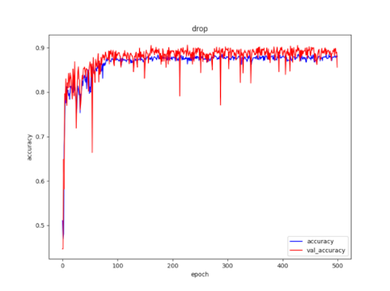
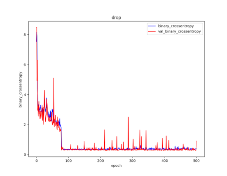

# MagRSS

This project aims to recollect fingerprint data from smartphone's built-in magnetometer, GPS, and cellular Received Signal Strength (RSS) in order to train a machine learning model.

By doing a mapping between...:

```
 { Geomagnetic field strength  and Cellular signal strength }
↳{Road Lane Position a.k.a *Road* or *Sidewalk*}
```

...And training a Neural Network with the above data *(and some crowdsourcing of course!)*, we can hopefuly localize users/smartphones position relative to the road using only the latter sensors (magnetometer and cellular) without having to rely on the resource-intensive GPS module.

## Proof of concept

Have a smartphone application that logs:
+ GPS
+ Accelerometer
+ Gyroscope
+ Magnetometer
+ Cellular towers RSS


Have the user collect and label the entries as
+ Road
+ Sidewalk

Depending on where the measurements are being taken


The log from the sensors should provide a distinction between either of both lanes and should be suitable for labeling the entries and training a ML model.

## Usage Flow


## Android Application


The Android application will start to automatically log each of the aforementioned parameters once the 'Train' toggle is activated. When finished roaming around collecting GPS coordinates and fingerprints, the application will output a .csv file containing all collected data.

### Example training data entries (.csv)

latitude | longitude | magnetometer X | magnetometer Y | magnetometer Z | cellID001_dBm | cellID002_dBm | *cellID...* | LABEL | hour of day (HH)
-------- | --------- | -------------- | -------------- | -------------- | ------------- | ------------- | --------- | ----- | ---------
24.7893686 | 120.9950572 | 15.599999 | 15.54 | -43.02 | -85 | -80 | ... | SIDEWALK | 1700
24.789374 | 120.9950519 | 38.579998 | 15.0 | -21.06 | -85 | -80 | ... | SIDEWALK | 1700
... | ... | ... | ... | ... | ... | ... | ... | ... | ...
24.7895087 | 120.9949591 | 43.379997 | 8.4 | 8.58 | - | -94 | ... | ROAD | 1700
... | ... | ... | ... | ... | ... | ... | ... | ... | ...

Notice how *cellID001* does not have a measurement in all entries, this is because the smartphone won't always be attached to this Access Point for all locations where the logs are being collected.

## Data Preprocessing

### Magnetometer Signal Filtering

Raw magnetometer signal from the smartphone tends to be really noisy. We apply a Kalman Filter to reduce noise and estimate the actual 'ground truth'.


Use autocorrelation function to find the signal's repeating pattern. There exists a linear correlation between two values of the same function at different time windows.

| | |
| :---: | :---: |
 |  |

### Cellular Access Points Filtering

We log and plot the attached cells and their intensity in dBm, and also overlay vertical lines at the previously obtained indexes to confirm that there is indeed a 'cellular connection' pattern.


Notice however that despite collecting data multiple times over the same closed loop, there are some cells *(cellID443, cellID476, cellID188, and cellID 195 in this case)* that do not 'appear' (the smartphone does not connect to) at all times.

In this case, we performed a one-way Analysis of Variance (ANOVA) between window period to clean-up these residual signals.

## Training

* Sequential Multi-layer perceptron
  * Two hidden layers, 128 nodes each
  * ReLU activation function
* Dropout layers
  * 0.2 fraction for the nodes to be dropped per training Epoch
* Weight regularization
  * L2 = 0.001 regularizer to drive weigths that are close to 0

```
-----------------------------------------------------------------
Layer (type)                 Output Shape              Param #
=================================================================
dense_features (DenseFeature multiple                  0
-----------------------------------------------------------------
dense (Dense)                multiple                  1920
-----------------------------------------------------------------
dropout (Dropout)            multiple                  0
-----------------------------------------------------------------
dense_1 (Dense)              multiple                  16512
-----------------------------------------------------------------
dropout_1 (Dropout)          multiple                  0
-----------------------------------------------------------------
dense_2 (Dense)              multiple                  129
=================================================================
Total params: 18,561
Trainable params: 18,561
Non-trainable params: 0
-----------------------------------------------------------------
```

### Evaluation

| loss | acc | binary_crossentropy | val_loss | val_acc | val_binary_crossentropy |
| :---: | :---: | :---: | :---: | :---: | :---: |
| 0.4660 | **0.8762** | 0.4516 | 0.3853 | **0.9022** | 0.3709 |

| | |
| :---: | :---: |
 |  |


## Future work

To expand the project, more fingerprints from more locations should be collected and further cleaned up. Entries used for the proof of concept are located at ```tf/train/files/```

Different NN models are also to be evaluated. Currently the script ```tf/train/nn_launcher.py``` facilitates the configuration and execution of different configurations of NN models and layouts.
